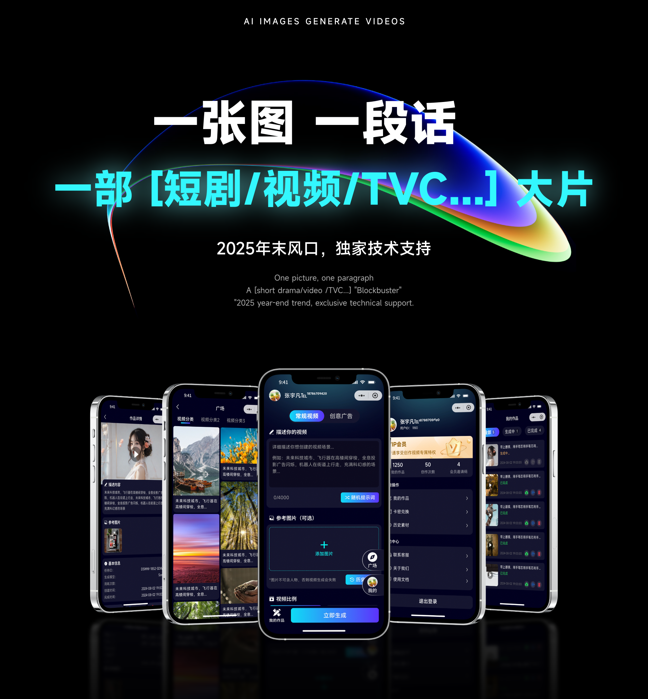
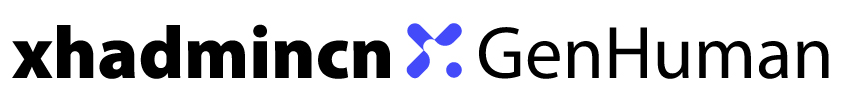

  

  <u><h1>最强Sora套壳应用 - 光看UI设计就已经赢得了大半市场.</h1></u>

  

 

# 不要瞧不起套壳🚀

不要觉得自己掌握一门技术就很拽，真正厉害的人是对技术一知半解，能够知道市场需要什么、自己能做什么，而不是把技术揣兜里。

所以我不反对技术套壳，我反对那些自以为是的人，反对那些总是把割韭菜挂在嘴边的人。

这套UI设计花费了不少精力，前端开发也是用了几天时间，今天把前端无条件免费分享给大家。

 

# Sora-2 API

- API接口目前免费开放，截止时间待定！

# Sora-2 Uniapp 都有哪些功能？

- 2025/10/22

- [x] 文生视频，10秒/15秒/25秒（独家）

- [x] 提示词优化，一键优化符合Sora脚本的文案

- [x] 卡密功能，可自定义卡密使用次数

- [x] 作品管理，可复用提示词和参考图

- [x] 视频比例支持16:9和9:16

- [x] 历史素材管理，可选择历史上传的素材快速创作

- [x] 常规模式就是纯的Sora-2，广告创意是对分镜镜像了自动处理。

- [x] 会员体系，月卡、年卡、季度卡后台自定义

- [x] 算力充值，套餐自定义，用户自助充值。

- [x] 联系客服、关于我们、使用文档等

- [x] 视频超清，720P直接提升到2k或者4k

- [x] 广场社区，好的作品会被分享，从而被看见，直接复用

- [x] 太多功能，直接写不完，所有功能前端均已实现，可自定开发后端对接。

# Sora-2 Uniapp 的亮点

- 一套代码，多端兼容，无需重复编码  
- 精心设计的UI界面，高端大气有档次
- Sora-2 API日调用上百万，并发小问题
- 原始视频无水印，不是特殊处理，无痕迹
- API目前免费调用，10秒、15秒、25秒全部
- 前端全开源，二次开发没有任何风险
- 亮点太多，随便用，就是为了交个朋友

 

# 持续迭代升级

如果你有好的想法和创意，欢迎提出来，我们会根据实际情况采纳。

来一波真实的体验，让你欲罢不能。

  

# 与我联系

如有疑问或建议，请随时联系：

- Email: 416716328@qq.com
- Wechat/Tel: 18786709420

当前开源只是前端代码，能来到开源社区想必是懂点技术的，所以请尊重各自的劳动成果。

# 后端代码

- PHP开发的，基于xhadmin框架（xhadmin.cn）
- 后端代码为付费产品，如不需要，可直接使用前端代码，无任何版权纠纷。

 

# 感谢贡献

- hbernet：(https://github.com/Hbernet)
- sunbo11112(https://github.com/sunbo11112)
- xhadmin(https://xhadmin.cn/)